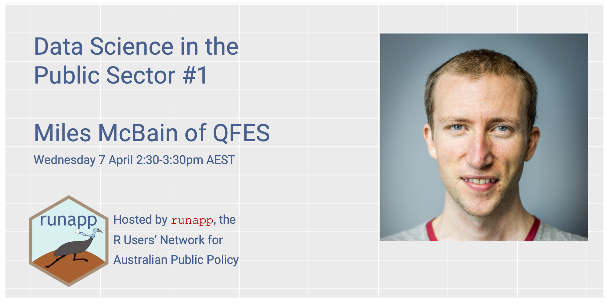

```{r setup, include=FALSE}
knitr::opts_chunk$set(echo = FALSE)
```

Get excited! `runapp` will host its first public event on Wednesday 7 April, when R superstar Miles McBain leads a discussion about doing data science in the public sector.

Sign up for free to attend this Zoom event at [Eventbrite](https://www.eventbrite.com.au/e/data-science-in-the-public-sector-1-miles-mcbain-tickets-148104417299).


