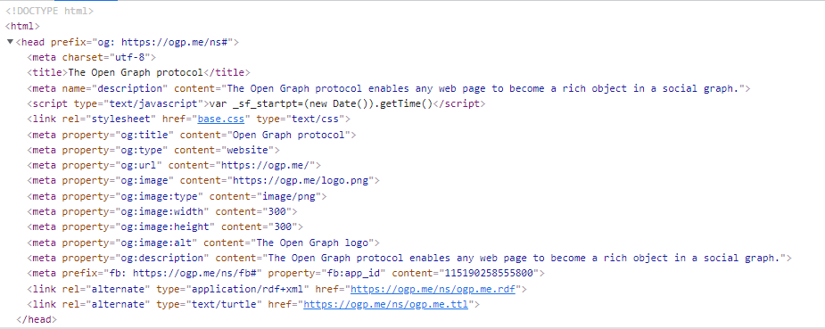

<link rel="stylesheet" href="https://stackpath.bootstrapcdn.com/bootstrap/4.3.1/css/bootstrap.min.css" integrity="sha384-ggOyR0iXCbMQv3Xipma34MD+dH/1fQ784/j6cY/iJTQUOhcWr7x9JvoRxT2MZw1T" crossorigin="anonymous">

<script src="https://cdnjs.cloudflare.com/ajax/libs/popper.js/1.14.7/umd/popper.min.js" integrity="sha384-UO2eT0CpHqdSJQ6hJty5KVphtPhzWj9WO1clHTMGa3JDZwrnQq4sF86dIHNDz0W1" crossorigin="anonymous"></script>
<script src="https://stackpath.bootstrapcdn.com/bootstrap/4.3.1/js/bootstrap.min.js" integrity="sha384-JjSmVgyd0p3pXB1rRibZUAYoIIy6OrQ6VrjIEaFf/nJGzIxFDsf4x0xIM+B07jRM" crossorigin="anonymous"></script>

<script src="https://cdn.datatables.net/1.11.3/css/dataTables.bootstrap4.min.css"></script>


```{r setup, include=FALSE, echo=FALSE, message=FALSE}
knitr::opts_chunk$set(echo = FALSE,
                      message = FALSE,
                      warning = FALSE)

library(rvest)
library(dplyr)
library(purrr)
library(htmltools)
library(knitr)

# TODO: the below code did not work but it is a clearer approach than the manual links above and the style below
# withTags(
#   head(
#     link(rel="stylesheet",
#          href="https://stackpath.bootstrapcdn.com/bootstrap/4.3.1/css/bootstrap.min.css",
#          integrity="sha384-ggOyR0iXCbMQv3Xipma34MD+dH/1fQ784/j6cY/iJTQUOhcWr7x9JvoRxT2MZw1T",
#          crossorigin="anonymous"),
#     script(src="https://cdnjs.cloudflare.com/ajax/libs/popper.js/1.14.7/umd/popper.min.js",
#            integrity="sha384-UO2eT0CpHqdSJQ6hJty5KVphtPhzWj9WO1clHTMGa3JDZwrnQq4sF86dIHNDz0W1",
#            crossorigin="anonymous"),
#     script(src="https://stackpath.bootstrapcdn.com/bootstrap/4.3.1/js/bootstrap.min.js",
#            integrity="sha384-JjSmVgyd0p3pXB1rRibZUAYoIIy6OrQ6VrjIEaFf/nJGzIxFDsf4x0xIM+B07jRM",
#            crossorigin="anonymous"),
#     script(src="https://cdn.datatables.net/1.11.3/css/dataTables.bootstrap4.min.css")
#     )
#   )
```

<style>
.card {
 
border: 2px solid #e7e7e7;
padding: .5rem;
 
}
</style>


```{r functions, echo=FALSE}


read_meta <- function(url, n = 400){
  
  doc <- readLines(url, n = n) |> # add way to check for end of header and iterate if not found
    paste0(collapse = '') #|> # cleans parts of page where tag contents are across multiple rows
  
  # clean doc of non-utf characters
  doc <- gsub('’', "'", doc)
  doc <- gsub('’', "'", doc)
  doc <- gsub('Â', "", doc)
  doc <- gsub('ÂÂ', " ", doc)
  doc <- gsub('–', "-", doc)
  
  nodes <- doc |>
    read_html() |>
    html_nodes('meta, title')

  meta_prop <- nodes |>
    map_dfr(~ tibble(property = html_attr(.x, 'property'),
                     content = html_attr(.x, 'content'))) |>
    filter(!is.na(property))
    
  meta_name <- nodes |>
    map_dfr(~ tibble(property = html_attr(.x, 'name'),
                     content = html_attr(.x, 'content'))) |>
    filter(!is.na(property))

  meta <- bind_rows(meta_prop, meta_name)
  # check for a title
  title <- nodes |> html_nodes(xpath = "/html/head/title") |> html_text()
  title_tag <- if ('og:title' %in% meta$property) 'title' else 'og:title'
  
  if (length(title) > 0) {
    meta <- meta |>
      add_row(property = title_tag,
              content = title)
  }
  
  return(meta)
  
}


card_url <- function(url, title, description, image, metadata_available, metadata_n){
  
  if (is.na(metadata_n)) metadata_n <- 100
  
  metadata_predefined <- tribble(~ property,       ~ content,
                                 'og:url',         url,
                                 'og:title',       title,
                                 'og:description', description,
                                 'og:image',       image)
  details <- read_meta(url, metadata_n) |>
    distinct()
  
  if (nrow(details) == 0){
    details <- metadata_predefined
  } else if (!any(grepl('og:', details$property))){
    details <- details |>
      bind_rows(metadata_predefined)
  } else if (!metadata_available) {
    details <- full_join(metadata_predefined, details) |>
      filter(!is.na(content)) |>
      group_by(property) |> 
      slice(1)
  }
  
  card_title <- details |> filter(property == 'og:title') |> pull(content)
  card_url <- details |> filter(property == 'og:url') |> pull(content)
  card_text <- details |> filter(property == 'og:description') |> pull(content)
  card_img <- details |> filter(property == 'og:image') |> pull(content)
  card_img_alt <- details |> filter(property == 'og:image:alt') |> pull(content) # TODO: use title if metadata missing
  
  card_author <- details |> 
    filter(property == 'author') |> 
    pull(content) |>
    paste(collapse = '')
  

  
  # update input data list from web
  if (is.na(out[out$link == url, 'title'])) {
    out <<- out |> 
      mutate(title = ifelse(.data$link == .env$url, 
                            .env$card_title, 
                            .data$title))
  }

  if (is.na(out[out$link == url, 'description'])) {
    out <<- out |> 
      mutate(description = ifelse(.data$link == .env$url, 
                              .env$card_text, 
                              .data$title))
  }

  
  
  # render bootstrap card
  div(class = 'card rounded border-dark',
      style = 'margin-bottom:70px',
      div(class="row no-gutters",
          div(class = 'col-sm-7',
              div(class = 'card-body',
                  h4(class = 'card-title',
                     a(href = card_url,
                       card_title)
                     ),
                  p(class="card-text text-secondary",
                    card_text),
                  p(class="card-text text-secondary",
                    if (card_author != '') {
                      div("Author(s):", br(), card_author)
                    })
                )
              ),
          div(class = 'col-sm-5',
              if (length(card_img) > 0) img(class="card-img-top h-100", src = card_img, alt = card_img_alt) else ''
              )
          )
      )
}

safe_card <- safely(card_url)


resources_add <- function(input_list, type){
    x <- input_list[[type]] |>
      split(f = input_list[[type]]$link) |>
      map(~ safe_card(.x$link, .x$title, .x$description, .x$img, .x$metadata_available, .x$metadata_n)) |>
      keep(~ !is.null(.x$result)) 
    
    names(x) <- NULL
  
    xx <- lapply(x, function(x){x$result})
  
    return(tagList(xx))
    
}
```


```{r lists}

out <- readr::read_csv('data/resources.csv') %>%
  mutate(metadata_available = metadata_available == 'yes')

output_list <- split(out, out$type)


```

## Books


```{r print books}

br <- resources_add(output_list, 'Books')

br

```


## Guides


```{r print Guides}

gr <- resources_add(output_list, 'Guides')

gr

```


## Tutorials

```{r print Tutorials}

tr <- resources_add(output_list, 'Tutorials')

tr

```


## Blogs

```{r print Blogs}

blr <- resources_add(output_list, 'Blogs')

blr

```


## Videos

```{r print Videos}

vr <- resources_add(output_list, 'Videos')

vr

```


## Learning Tools

```{r print Learning Tools}

ltr <- resources_add(output_list, 'Learning Tools')

ltr

```


## Course Materials

```{r print Course Materials}

cmr <- resources_add(output_list, 'Course Materials')

cmr

```


## Other Resource Lists

```{r print Resource Lists}

rlr <- resources_add(output_list, 'Resource Lists')

rlr

```


## Search


```{r search, echo=FALSE}

dt <- out |>
  select(type, link, description) |>
  mutate(description = iconv(description),
         link = glue::glue('<a href={link}>{link}</a>')) |>
  DT::datatable(rownames = FALSE, 
                escape = FALSE,
                filter = list(position = 'top'), 
                options = list(pageLength = 5,
                               searchHighlight = TRUE))

dt
```


## Add to this Page

If you know of a resource that you think should be included on this list you are welcome to add it. Simply fork this repo make your changes and [submit a pull request](https://docs.github.com/en/pull-requests/collaborating-with-pull-requests/proposing-changes-to-your-work-with-pull-requests/about-pull-requests).

All the resources in this are organised via a [CSV file](https://github.com/runapp-aus/runapp_website/blob/r-resources/data/resources.csv). When you look at this list you will not that some entries only have values in the first 4 fields:

1. type	
2. metadata_available	
3. metadata_n
4. link

In these cases the `metadata_available` value is "yes". This means that all the needed metadata can be automatically downloaded via the resources web metadata. The `metadata_n` field indicates how much of the URL needs to be read in order to get all the needed metadata (more on this later). 

You can test yourself if the metadata of the resource you wish to add is available using the following helper function.

```r
read_meta <- function(url, n = 400){
  
  doc <- readLines(url, n = n) |> 
    paste0(collapse = '') #|> # cleans parts of page where tag contents are across multiple rows
  
  nodes <- doc |>
    read_html() |>
    html_nodes('meta, title')

  meta_prop <- nodes |>
    map_dfr(~ tibble(property = html_attr(.x, 'property'),
                     content = html_attr(.x, 'content'))) |>
    filter(!is.na(property))
    
  meta_name <- nodes |>
    map_dfr(~ tibble(property = html_attr(.x, 'name'),
                     content = html_attr(.x, 'content'))) |>
    filter(!is.na(property))

  meta <- bind_rows(meta_prop, meta_name)

  title <- nodes |> html_nodes(xpath = "/html/head/title") |> html_text()
  title_tag <- if ('og:title' %in% meta$property) 'title' else 'og:title'
  
  if (length(title) > 0) {
    meta <- meta |>
      add_row(property = title_tag,
              content = title)
  }
  
  return(meta)
  
}
```

Just run the function in R to get a table of available metadata. What we are looking for here are fields for a title, description and image. Usually these fields are prefixed with `og:` which indicates they comply with the [Open Graph metadata](https://ogp.me/) standard. Indeed if we test the Open Graph website, we get the following:

```{r, echo=TRUE}
read_meta('https://ogp.me/', n = 100) |> knitr::kable()
```


If you get a complete metadata record simply add the details to the first three fields, including `metadata_available` as "yes" and `metadata_n` as "100". The `metadata_n` field is needed in order to limit the amount of each webpage that is read; remember we are only after the metadata and this is generally found in the first 100 rows. Increment `n` by 100 until you get something. You can see exactly where the metadata is by inspecting the resources code.



Where a resources metadata does not include a title, description and image; please add these additional fields to the CSV and set `metadata_available` value as "no".

And that's it. You have added a new R resource to the list.


